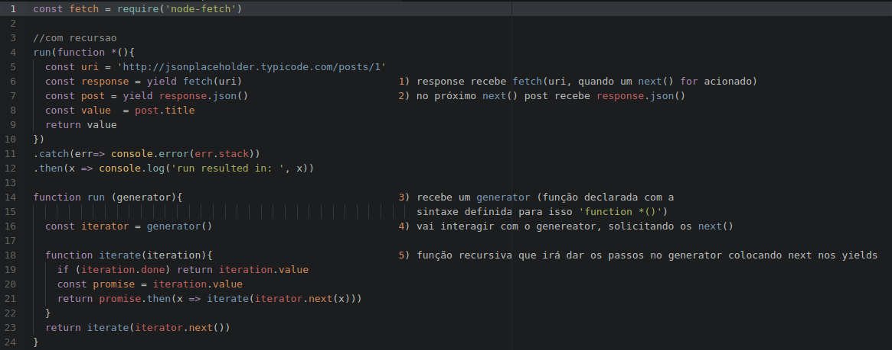

# Artigo sobre generators

## Explanação sobre o problema
  No Node.js® os eventos são executados iniciados a cada iteração do loop de eventos,
e são executados assincronamente nos manipuladores de evento, esse comportamento
torna as execuções mais performáticas, otimiza o processamento e causa no usuário a
sensação de que tudo está acontecendo "ao mesmo tempo", [mais informações podem ser
encontradas aqui](https://www.tutorialspoint.com/nodejs/nodejs_event_loop.htm).
  Porém, em certas ocasiões é necessário tratar de maneira específica o
comportamento de determinada função, para esses casos, podemos lançar mão dos
generators, que nos permitem definir comportamentos específcos nas iterações do
loop de eventos.

### O que são generators e quando utilizar?
  Generators é o recurso que nos permite pausar e continuar a execução de
funções assíncronas, de acordo com nossa necessidade, na prática, é o que
nos permite executar funções assíncronas "como se fossem" executadas de maneira
síncrona.
  O uso de generators pode ser aplicado, quando vamos executar uma função que
DEPENDE da resposta de outra e só encadear não é o suficiente.

### Como utilizar?
  O uso dos generators pode parecer confuso num primeiro momento, mas com a prática,
  como tudo na vida, fica bem tranquilo.
  Começamos chamando uma função recebendo o generator sintaxe function \*()
  *a sintaxe do generator é: function *()*

  ```
  run(function *()){
      //algum código aqui
  }
  ```

  agora, declaramos a função run
  ```    
  function run (generator){                
    //algum código aqui
  }
  ```

  Aqui é que começa a ficar ~~complicado~~ **legal**
  Dentro de  **_run_** iremos fazer uma requisição com *node-fetch*[mais informações aqui](https://www.npmjs.com/package/node-fetch)
  porém, iremos interagir com os resultados da requisição. E aqui começa a
  fazer sentido o uso dos generators.

  **Yield** - esse cara tem a responsabilidade ["fornecer"](https://translate.google.com/#en/pt/yield) para nós,
  o resultado de uma promise, simplificando, quANFD, quando solicitamos o next(). O interpretador bate no yield e só continuar
  a execução do programa, quando o próximo next for chamado.

  Aqui o código com alguns comentários:
  

  Aqui o código caso você queira testar:
  ```
    const fetch = require('node-fetch')

    run(function *(){
      const uri = 'http://jsonplaceholder.typicode.com/posts/1'
      const response = yield fetch(uri)                         
      const post = yield response.json()                        
      const value  = post.title
      return value
    })
    .catch(err=> console.error(err.stack))
    .then(x => console.log('run resulted in: ', x))

    function run (generator){                                   

      const iterator = generator()                              

      function iterate(iteration){                              
        if (iteration.done) return iteration.value
        const promise = iteration.value
        return promise.then(x => iterate(iterator.next(x)))
      }
      return iterate(iterator.next())
    }  
  ```


### Nem tudo são flores :S
  Utilizar generators prejudica muito a velocidade de execução do nosso código,
portanto use somente se necessário, caso contrário, deixe que o event loop siga
seu curso tranquilo para que o máximo de desempenho da linguagem seja aproveitado.


### Conclusão
  Bom, esse artigo foi feito somente como forma de fixação de conhecimento, mas espero
que esse conhecimento seja útil a alguém além de mim, afinal, **conhecimento não compartilhado, é nulo**.


## Referências
[strongloop.com](https://strongloop.com/strongblog/how-to-generators-node-js-yield-use-cases/)

[funfunfunction - canal do youtube, somente em inglês](https://www.youtube.com/watch?v=ategZqxHkz4&list=PL0zVEGEvSaeFSwPn06GKArptSxiP1Gff8&index=34)

## Indicações
*Esse artigo não teria sido produzido se não fosse pela [webschool.io](https://www.youtube.com/channel/UCKdo1RaF8gzfhvkOdZv_ojg) *

*Para mais conhecimento sobre o mundo JS, anarquia ou novas ideias, aqui vai o blog do tio Suissa [nomadev](http://nomadev.com.br/)*
