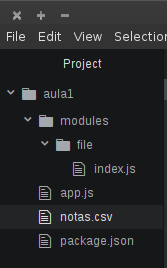
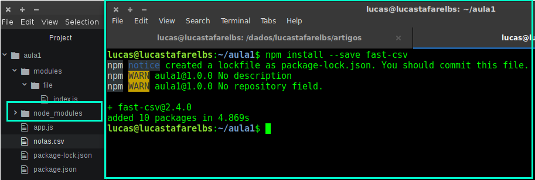

#### Primeira Aula para novos desenvolvedores

 _*Olá pessoa, nessa aula daremos sequência ao conteúdo iniciado [nessa playlist do Rodrigo Branas](https://www.youtube.com/playlist?list=PLQCmSnNFVYnT1-oeDOSBnt164802rkegc), se você ainda não assistiu, comece por ela, lá ele vai ensinar os princípios do JavaScript e isso é pré-requisito para a continuação das aulas, também é importante que você tenha o [NODE.JS](https://nodejs.org) instalado em sua máquina*_

 _*Obs: Sempre que possível, desde que não prejudique o bom entendimento do aluno usarei Inglês, em ambiente real, isso é boa prática, dentre outras razões, facilita a nomenclatura/entendimento do código*_

##### O que você aprenderá **agora** ?
  + Separação de funcionalidades por módulos
  + Melhores práticas de organização de diretórios para projetos
  + Manipulação de dados com arquivos .CSV
    * Utilizaremos um arquivo .csv com nomes e notas dos alunos como fonte de dados e utilizaremos esses no nosso programa

##### Para que eu vou usar isso na minha vida?
  + Esse aula é importante pois será a base para qualquer programa desenvolvido utiliando nodejs, além disso, a manipulação de arquivos faz parte do dia a dia de qualquer desenvoledor.
    - Podemos utilizar um arquivo como fonte de dados para fazer a importação de dados ou backup de um sistema existente, para carregá-los no sistema que estamos desenvolvendo.
    - Podemos utilizar arquivos para automatizar tarefas, como por exemplo enviar vários emails para uma lista de email (presente em um arquivo).
    - Podemos executar determinadas rotinas no nosso sistema e então gerar um arquivo para que outro sistema (desenvolvido por nós mesmos, ou não) possa utilizar.

#### [Aqui está o código final do projeto - em breve]() 

#### Vamos começar :)

  __1) Primeiro iniciaremos um novo projeto com nodejs, para isso, crie uma pasta em um diretório que você localize facilmente pelo terminal__
  + Navegue até o diretório escolhido e crie uma nova pasta com o nome **aula1**
  + Agora, pelo terminal, abra o diretório criado e inicie um novo projeto com **npm init**, você será questionado algumas vezes, basta responder as questões até o final, para não responder alguma questão, apenas, pressione a tecla **ENTER**, repare que agora existe na pasta um arquivo chamado **package.json** ele é o arquivo que descreve detalhes do nosso projeto, como as questões que respondemos na inicialização, nossa dependências de _plugins externos(falaremos disso nos próximos passos)_ entre outras coisas
  - Veja o exemplo:

  

  __2) Aqui começa a diversão, para programar com JavaScript, só precisamos de um editor de texto simples, fique à vontade para escolher. Minha indicação é o [ATOM](https://atom.io) desenvolvido com **JS** pela equipe do [GitHub](https://github.com/)__
  + Abra o atom e adiocione uma nova pasta de projeto e selecione a pasta que nós criamos com o nome de **aula1**
    - file > add project folder (dependendo do idioma do seu sistema operacional)
  + Clique com o botão direito sobre essa pasta, adicione um novo arquivo e nomeie-o como **app.js**
  + Adicione também uma nova pasta e nomeie-a como **modules**
  + Dentro de modules, adione mais uma pasta e nomeie-a de **file**
  + Dentro de **file** crie um novo arquivo e nomeie-o de **index.js**
  + Separar as nossas funcionalidades em módulos facilita a organização do projeto, manutenções e _*é boa prática de desenvolvimento manter o projeto o mais limpo e organizado possível*_.
  + **Muitíssimo cuidado com a criação dessa estrutura, errar causará erros na utilização dos arquivos** sua estrutra deverá ficar exatamente assim:

  

  __3) Primeiro criaremos funções simples para que fique muito claro o uso de arquivos separados, iremos simplesmente crirar uma função que escreva uma mensagem na tela, colocaremos essa função no arquivo index.js que está em file e então a usaremos no arquivo app.js__
  + coloque o seguinte código dentro de index.js:
  ```js
    module.exports = {
      printMessageOnScreen : function ( messageToPrint ) {
        console.log( messageToPrint || 'Mensagem Padrão')
      }
    }
  ```
  + O module.exports irá **exportar** um objeto, nesse exemplo, nosso objeto tem a propriedade _*printMessageOnScreen*_ que é uma função que recebe uma _*mensagem como **argumento***_ e imprime essa mensagem com o **console.log()**, como vimos, quando não colocamos valor em uma variável, ou argumento, este fica com valor **null** e podemos validar se um valor estiver **null** e atribuir um valor padrão para a nossa rotina, nesse caso, se **messageToPrint** não for preenchida, então a preencheremos com o valor _*Mensagem Padrão*_
  + Para poder utilizar a função **printMessageOnScreen** em app.js, coloque o seguinte código no arquivo:
  ```js
  const File = require('./modules/file/index')

  File.printMessageOnScreen('Mensagem numero 1')
  File.printMessageOnScreen('Mensagem numero 2')

  // Se não definirmos nenhuma mensagem, a mensagem "Mensagem Padrão"
  File.printMessageOnScreen()
  ```
  + Repare na linha ``` const File = require('./modules/file/index')```, ela está falando que **File** tem o conteúdo que foi exportado pelo **module.exports** que está dentro de file.js, ```require('./modules/file/index')``` essa parte significa que estamos utilizando o arquivo **index** que estpa dentro do diretório **file** que está dentro do diretório **modules**, que por sua vez, está no mesmo diretório que **app.js**, o caracter **./** signfica: **à partir desse diretório**
  + Também podemos ler essa linha dessa maneira: **esse arquivo é o app.js, dentro da mesma pasta, tem a pasta **modules**, entre nela, depois entre em **file** que está dentro dela, então, pegue para mim o arquivo que chama **index**. Note que não utlizamos o .js no final, porque não é necessário, mas se colocassemos, não faria a menor diferença.

  __4) Agora que temos nosso programa pronto é a hora de executá-lo__
  + Pelo terminal, vá até a pasta onde criamos o projeto e execute node app.js, se acontecer algum erro, verifique novamente a estrutura das pastas e os nomes das variáveis, arquivos, lembre-se que JavaScript é __*Case Sensitive*__, isso significa que ele faz diferença entre letras maiúsculas e minúsculas.
  + Se tudo correu bem, você tem isso aqui:

  

***
  __5) À partir de agora, não usaremos mais esse código, sinta-se à vontade para criar uma cópia do diretório aula1, ou simplesmente faça o novo código sobrescrevendo esse, _*no problems*_ era só para você entender o funcionamento do **module.exports e require**, com isso muito claro na mente, vamos adicionar mais um pouco de conteúdo, agora é a hora de ler o arquivo .csv para calular as médias.__
  + A primeira coisa que você precisa é ter um .csv para servir de base,
   pelo próprio editor, no diretório aula1 clique com o botão direito, cole o conteúdo abaixo e salve como **notas.csv**
   ```
    nome;nota1;nota2
    Pessoa Um;5;6
    Pessoa Dois;7;10
    Pessoa Três;3;9
    Pessoa Quatro;8;1
    Pessoa Cinco;6;3
   ```
  + Agora sua nova estrutura deve estar assim, verifique os nomes dos arquivos e dos diretórios, não erre nada agora, se errou já acerte, senão depois vai dar mais trabalho:

  

  __6) Agora vamos adicionar o plugin para ler o nosso notas.csv__
  + O nodejs trabalha conta com uma base gigante de plugins, [você pode dar uma olhada aqui](https://www.npmjs.com), para podermos pegar o conteúdo do .csv, precisaremos adicionar um plugin para leitura de csv ao nosso projeto, isso é feito através do **npm**
  + vá ao terminal, navegue até o diretório do projeto **aula1** então digite **npm install --save fast-csv**
    - Esse comando serve para instalar o plugin **fast-csv**, a flag **--save** serve para que o npm adicione esse plugin ao nosso arquivo package.json, dessa forma, ele ficará declarado como dependência do projeto.
    - Você pode ver a documentação do plugin [clicando aqui](http://c2fo.io/fast-csv/index.html), acostume-se a ler documentação, é o jeito mais rápido e eficaz de aprender uma nova ferramenta, linguagem, etc.
  + Após executar o comando, você vai perceber que será criado o diretório node_modules no diretório do nosso projeto, isso é normal, todos os módulos externos que usaremos no projeto ficarão nesse diretório.
  + À esquerda na imagem o destaque para o novo diretório criado, à direita, a execução do comando **npm i --save fast-csv**

  

  __7)Agora vamos alterar nosso index.js que está em modules/file/__
  + Para utilizar plugins, precisamos fazer **require** assim como fazemos aos nossos arquivos.
  + O Módulo **fs** utilizado aqui é __*Nativo*__ do nodejs, ou seja, faz parte dos arquivos usados pelo próprio _*nodejs*_, para utilizar módulos nativos, não preicsamos intalá-los, basta fazer o require e utilizar
  + coloque o conteúdo a seguir no arquivo index.js:
  ```js
  // Essa linha faz o require do módulo fast-csv, que nós instalamos anteriormente
  const csv = require('fast-csv')

  // Essa linha faz o require para o módulo fs, que é nativo do nodejs ele serve para
  // podermos trabalhar com o filesystem, para acessars arquivos e outras coisas
  const fs = require('fs')

  module.exports = {
    getDataFromCSV: function ( csvFile ) {

      const myPromise =  new Promise( function ( resolve, reject ) {
         const dataFromCSV = []
         fs.createReadStream( csvFile )
         .pipe(csv( {headers: true, delimiter:';'} ))
         .on("data", function(data){
             dataFromCSV.push(data)
         })
         .on("end", function(data){
            resolve(dataFromCSV)
         })
      })
      return myPromise
    }
  }
  ```
  + O modulo de leitura de arquivo precisa de uma Promise, como o JavaScript trabalha de maneira **Assíncrona**, fazemos usos de promises, mas isso é assunto para um próximo artigo, entenda que em index.js nós criamos um **módulo de leiura de arquivo csv, que lê o arquivo que passamos para  a função como argumento, por enquanto isso é o suficente.**

  __8) Para utilizarmos o nosso módulos, precisamos fazer o require dele lá no nosso app.js__
  + coloque o conteúdo a seguir no arquivo app.js:
```js
const File = require('./modules/file/index')
const csvFile = 'notas.csv'
const passingScore = 5

function printDataOnScreen( dadosLidosDoArquivo ) {
  console.log('--------------------')
  console.log('- Calculo da Media -')
  console.log('--------------------')

  dadosLidosDoArquivo.map( function ( valorAtual, indice ) {

    let result = ( ( Number(valorAtual.nota1) + Number(valorAtual.nota2) ) / 2 )

    console.log('Aluno : ' + valorAtual.nome)
    console.log('Nota 1: ' + valorAtual.nota1)
    console.log('Nota 2: ' + valorAtual.nota2)
    console.log('Media : ' + result )

    if ( result >= passingScore ) {
      console.log('Parabéns, você foi aprovado!')
    }
    else {
      console.log('Oops, Você precisa estudar mais, dessa vez não foi o suficiente!')
    }

    console.log('--------------------')
  })
}

File
  .getDataFromCSV( csvFile )
  .then( printDataOnScreen )
  .catch( function ( error ) { console.log( error ) }  )
```
  + Repare que no início do arquivo nós criamos uma série de constantes, sim, à partir de agora, trabalharemos com constantes, sempre que possível, e com **let** quando formos utilizar uma variável, num futuro terá um artigo sobre isso, mas entenda que é uma prática péssima utilizar **var** ou sómente declarar uma variável sem nada.
  +  Das constantes que criamos, csvFile é o nome do nosso arquivo csv que queremos ler, passingScore é a nossa nota de corte
  + A função **printDataOnScreen** pega o **array** de dados lidos do aqruivo .csv, calcula as médias e verifica se o aluno passou ou não, de acordo com a nota de corte. Além de printar os dados de maneira "formatada"
  + O foco dessa aula era somente a organização do projeto e o uso de módulos externos, só para não deixar dúvidas, as últimas linhas de app.js, são só a chamanda para a nossa função lá em index.js, e como ela retorna uma **promise**, precisamos, utilizar o **then** **catch**

***

__9) Como não poderia faltar, fica um exercício para fixação, repare como a nossa função *printDataOnScreen* está toatalmente separada do resto do código, isso faz com que ela possa facilmente fazer parte de outro *modulo*, assim sendo, crie um novo módulo chamado *printer*, crie um *index.js* para esse novo módulo, export a função printDataOnScreen por ele e então faça o require no app.js__
  + Esse está fácil, os próximos não serão tão suaves assim.


__10) Conclusão__
  + De tudo o que foi feito, as partes mais importantes são:
    - module.exports **exporta um objeto**
    - Para utilizar um módulo precisamos fazer **require**
    - Módulos externos tem que ser instalados com o comando **npm install --save nome_do_modulo**
    - **var** não é bom, muito menos declara só o nome sem nada antes
    - **let** ok, **const** é o que há!


  +  Para concluir, deixo uma citação que marcou muito o início da minha jornada como **Desenvolvedor**

  ``` Tudo aquilo que insistimos em fazer se torna fácil, não porque a natureza da tarefa mude, mas porque nossa capacidade aumenta." - Herber J. Grant ```

  + Espero que você tenha conseguido aprender algo novo e espero ter sido bem claro. Para tirar qualquer dúvida, estou disponível no telegram: **@lucastafarelbs**, esse cara também merece um artigo só dele :)
