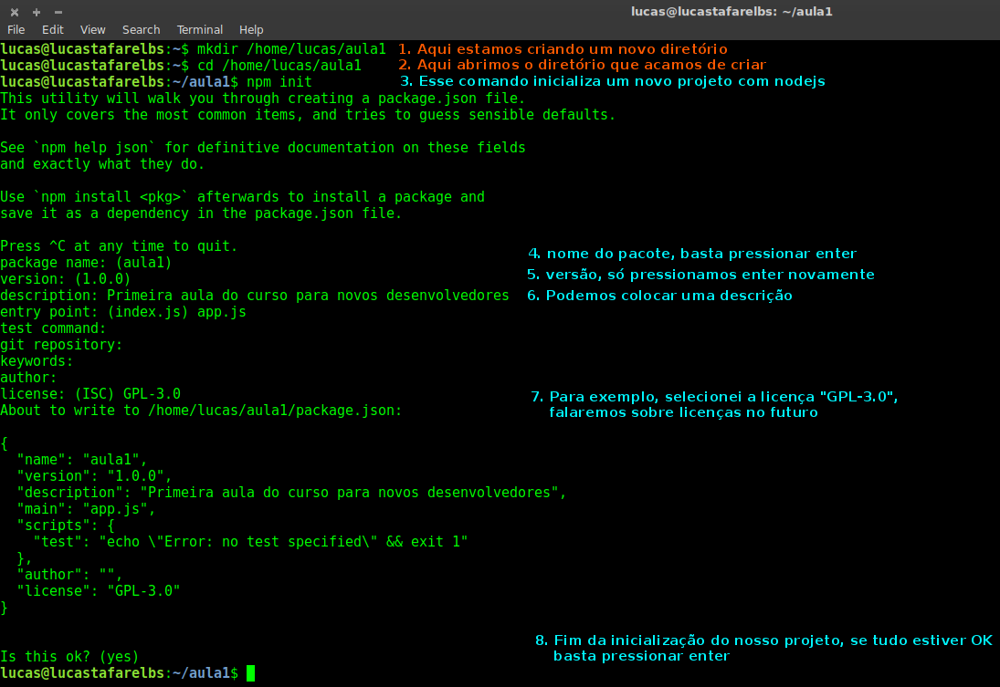
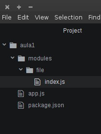
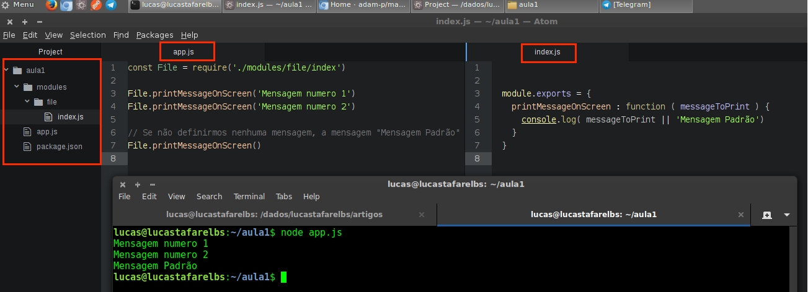

#### Primeira Aula para novos desenvolvedores

 _*Olá pessoa, nessa aula daremos sequência ao conteúdo iniciado [nessa playlist do Rodrigo Branas](link: playlist Rodrigo Branas), se você ainda não assistiu, comece por ela, lá ele vai ensinar os princípios do JavaScript e isso é pré-requisito para a continuação das aulas, também é importante que você tenha o [NODE.JS](https://nodejs.org) instalado em sua máquina*_

 _*Obs: Sempre que possível, desde que não prejudique o bom entendimento do aluno usarei Inglês, em ambiente real, isso é boa prática, dentre outras razões, facilita a nomenclatura/entendimento do código*_

##### O que você aprenderá **agora** ?
  + Separação de funcionalidades por módulos
  + Melhores práticas de organização de diretórios para projetos
  + Manipulação de dados com arquivos .CSV
    * Utilizaremos um arquivo .csv com nomes e notas dos alunos como fonte de dados e utilizaremos esses no nosso programa

##### Para que eu vou usar isso na minha vida?
  + Esse aula é importante pois será a base para qualquer programa desenvolvido utiliando nodejs, além disso, a manipulação de arquivos faz parte do dia a dia de qualquer desenvoledor.
    - Podemos utilizar um arquivo como fonte de dados para fazer a importação de dados ou backup de um sistema existente, para carregá-los no sistema que estamos desenvolvendo.
    - Podemos utilizar arquivos para automatizar tarefas, como por exemplo enviar vários emails para uma lista de email (presente em um arquivo).
    - Podemos executar determinadas rotinas no nosso sistema e então gerar um arquivo para que outro sistema (desenvolvido por nós mesmos, ou não) possa utilizar.

#### [Aqui está o código final do projeto](link: projeto final)

#### Vamos começar :)

  __1) Primeiro iniciaremos um novo projeto com nodejs, para isso, crie uma pasta em um diretório que você localize facilmente pelo terminal__
  + Navegue até o diretório escolhido e crie uma nova pasta com o nome **aula1**
  + Agora, pelo terminal, abra o diretório criado e inicie um novo projeto com **npm init**, você será questionado algumas vezes, basta responder as questões até o final, para não responder alguma questão, apenas, pressione a tecla **ENTER**, repare que agora existe na pasta um arquivo chamado **package.json** ele é o arquivo que descreve detalhes do nosso projeto, como as questões que respondemos na inicialização, nossa dependências de _plugins externos(falaremos disso nos próximos passos)_ entre outras coisas
  - Veja o exemplo:

  

  __2) Aqui começa a diversão, para programar com JavaScript, só precisamos de um editor de texto simples, fique à vontade para escolher. Minha indicação é o [ATOM](https://atom.io) desenvolvido com **JS** pela equipe do [GitHub](https://github.com/)__
  + Abra o atom e adiocione uma nova pasta de projeto e selecione a pasta que nós criamos com o nome de **aula1**
    - file > add project folder (dependendo do idioma do seu sistema operacional)
  + Clique com o botão direito sobre essa pasta, adicione um novo arquivo e nomeie-o como **app.js**
  + Adicione também uma nova pasta e nomeie-a como **modules**
  + Dentro de modules, adione mais uma pasta e nomeie-a de **file**
  + Dentro de **file** crie um novo arquivo e nomeie-o de **index.js**
  + Separar as nossas funcionalidades em módulos facilita a organização do projeto, manutenções e _*é boa prática de desenvolvimento manter o projeto o mais limpo e organizado possível*_.
  + **Muitíssimo cuidado com a criação dessa estrutura, errar causará erros na utilização dos arquivos** sua estrutra deverá ficar exatamente assim:

  

  __3) Primeiro criaremos funções simples para que fique muito claro o uso de arquivos separados, iremos simplesmente crirar uma função que escreva uma mensagem na tela, colocaremos essa função no arquivo index.js que está em file e então a usaremos no arquivo app.js__
  + coloque o seguinte código dentro de index.js:
  ```js
    module.exports = {
      printMessageOnScreen : function ( messageToPrint ) {
        console.log( messageToPrint || 'Mensagem Padrão')
      }
    }
  ```
  + O module.exports irá **exportar** um objeto, nesse exemplo, nosso objeto tem a propriedade _*printMessageOnScreen*_ que é uma função que recebe uma _*mensagem como **argumento***_ e imprime essa mensagem com o **console.log()**, como vimos, quando não colocamos valor em uma variável, ou argumento, este fica com valor **null** e podemos validar se um valor estiver **null** e atribuir um valor padrão para a nossa rotina, nesse caso, se **messageToPrint** não for preenchida, então a preencheremos com o valor _*Mensagem Padrão*_
  + Para poder utilizar a função **printMessageOnScreen** em app.js, coloque o seguinte código no arquivo:
  ```js
  const File = require('./modules/file/index')

  File.printMessageOnScreen('Mensagem numero 1')
  File.printMessageOnScreen('Mensagem numero 2')

  // Se não definirmos nenhuma mensagem, a mensagem "Mensagem Padrão"
  File.printMessageOnScreen()
  ```
  + Repare na linha ``` const File = require('./modules/file/index')```, ela está falando que **File** tem o conteúdo que foi exportado pelo **module.exports** que está dentro de file.js, ```require('./modules/file/index')``` essa parte significa que estamos utilizando o arquivo **index** que estpa dentro do diretório **file** que está dentro do diretório **modules**, que por sua vez, está no mesmo diretório que **app.js**, o caracter **./** signfica: **à partir desse diretório**
  + Também podemos ler essa linha dessa maneira: **esse arquivo é o app.js, dentro da mesma pasta, tem a pasta **modules**, entre nela, depois entre em **file** que está dentro dela, então, pegue para mim o arquivo que chama **index**. Note que não utlizamos o .js no final, porque não é necessário, mas se colocassemos, não faria a menor diferença.

  __4) Agora que temos nosso programa pronto é a hora de executá-lo__
  + Pelo terminal, vá até a pasta onde criamos o projeto e execute node app.js, se acontecer algum erro, verifique novamente a estrutura das pastas e os nomes das variáveis, arquivos, lembre-se que JavaScript é __*Case Sensitive*__, isso significa que ele faz diferença entre letras maiúsculas e minúsculas.
  + Se tudo correu bem, você tem isso aqui:
  
